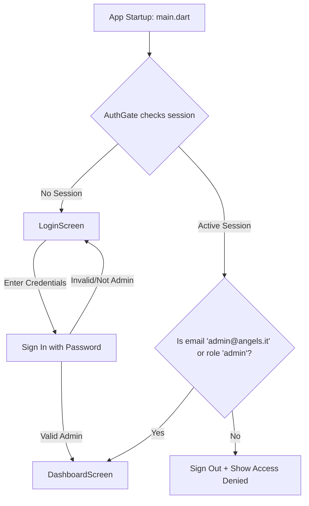

# Security Access Control and Database Policies Plan

This document outlines the security architecture designed and implemented to lock down the restaurant's `orders` database table in Supabase and enforce secure authentication protocols within the Flutter Manager App.

---

## 1. Database Level Security: Row-Level Security (RLS)

By default, PostgreSQL denies access to tables when Row-Level Security (RLS) is enabled, unless explicit policies permit it. We have set up strict RLS policies on the `orders` table to allow:
1. **Public/Anonymous Insertions**: Clients and guests can insert new orders into the system.
2. **Restricted SELECT and UPDATE**: Restricting visibility and updates strictly to the client who placed the order or to authorized administrators.

### Policy Details

The policies verify identity using:
* **Admin Role Claims**: Checking `auth.jwt() ->> 'email' = 'admin@angels.it'` or user metadata `(auth.jwt() -> 'user_metadata' ->> 'role') = 'admin'`.
* **Authenticated Clients**: Matching `auth.uid() = customer_id`.
* **Anonymous Guest Clients**:
  * **Verified Phone**: Checking if the user's authenticated phone number matches the order's `guest_phone` (`guest_phone = auth.jwt() ->> 'phone'`).
  * **Guest Token Cookie/Header**: Utilizing a unique `guest_token` (UUID) stored on the client side and passed via request headers (`x-guest-token`) or cookies (`guest_token`).

### SQL Migration Script
We have created the SQL migration file at:
[20260719020000_secure_orders.sql](file:///c:/Users/Utente/Desktop/Angels%20website/supabase/migrations/20260719020000_secure_orders.sql)

```sql
-- Adds the guest_token tracking column
ALTER TABLE public.orders ADD COLUMN IF NOT EXISTS guest_token UUID DEFAULT gen_random_uuid();

-- Enforce restricted read visibility
CREATE POLICY "Allow select access to orders for owners and admins"
ON public.orders FOR SELECT
USING (
  (auth.jwt() ->> 'email' = 'admin@angels.it') OR 
  ((auth.jwt() -> 'user_metadata' ->> 'role') = 'admin') OR
  (auth.uid() = customer_id) OR
  (guest_phone = (auth.jwt() ->> 'phone')) OR
  (guest_token::text = (COALESCE(NULLIF(current_setting('request.headers', true), ''), '{}')::json ->> 'x-guest-token')) OR
  (guest_token::text = (COALESCE(NULLIF(current_setting('request.cookies', true), ''), '{}')::json ->> 'guest_token'))
);

-- Enforce restricted update privileges (e.g. status changes, cancellations)
CREATE POLICY "Allow update access to orders for owners and admins"
ON public.orders FOR UPDATE
USING (
  (auth.jwt() ->> 'email' = 'admin@angels.it') OR 
  ((auth.jwt() -> 'user_metadata' ->> 'role') = 'admin') OR
  (auth.uid() = customer_id) OR
  (guest_token::text = (COALESCE(NULLIF(current_setting('request.headers', true), ''), '{}')::json ->> 'x-guest-token'))
)
WITH CHECK (
  (auth.jwt() ->> 'email' = 'admin@angels.it') OR 
  ((auth.jwt() -> 'user_metadata' ->> 'role') = 'admin') OR
  (
    -- Clients/Guests can only cancel their own orders (no accept/complete allowed)
    ((auth.uid() = customer_id) OR (guest_token::text = (COALESCE(NULLIF(current_setting('request.headers', true), ''), '{}')::json ->> 'x-guest-token')))
    AND status = 'cancelled'
  )
);
```

---

## 2. Next.js Web Client Integration

To support the RLS policy for guest checkouts, the web client should generate and attach the `guest_token` in headers when inserting or selecting orders.

### Implementation Suggestion (Next.js Client)

When a guest places an order, the web client:
1. Generates or retrieves a unique `guestToken` using `crypto.randomUUID()` in the browser.
2. Saves it in the browser's cookies or LocalStorage.
3. Submits it in the `orderPayload` and includes it as a PostgREST header on query requests:

```typescript
// 1. Generate token
const guestToken = window.localStorage.getItem('guest_token') || crypto.randomUUID();
window.localStorage.setItem('guest_token', guestToken);

// 2. Submit order with headers
const { data, error } = await supabase
  .from('orders')
  .insert({
    ...orderPayload,
    guest_token: guestToken
  })
  .headers({
    'x-guest-token': guestToken
  })
  .select()
  .single();
```

This guarantees that the client's own order is immediately returned successfully by the `insert().select()` chain and can be subscribed to.

---

## 3. Flutter Manager App Authentication Gate

To protect the kitchen dashboard from unauthorized access, we implemented a login screen and an `AuthGate` widget in the Flutter Manager app.

### Flutter Authentication Architecture



### Key Changes Applied:
1. **Added [LoginScreen](file:///c:/Users/Utente/Desktop/Angels%20website/manager_app/lib/screens/login_screen.dart)**: Form fields for Email/Password, loading indicator, role checking (emails matching `admin@angels.it` or metadata `role` matching `admin`), and visual feedback for incorrect credentials or role denial.
2. **Updated [main.dart](file:///c:/Users/Utente/Desktop/Angels%20website/manager_app/lib/main.dart)**: Created the `AuthGate` wrapper. Instead of defaulting to `DashboardScreen` immediately, it checks the active Supabase session first.
3. **Updated [dashboard_screen.dart](file:///c:/Users/Utente/Desktop/Angels%20website/manager_app/lib/screens/dashboard_screen.dart)**:
   * Added the **Log Out** button to the AppBar.
   * Tracks the `RealtimeChannel` instance and unsubscribes cleanly in `dispose()` and on logout.
   * Redirects the user back to the login screen and clears the navigation stack on sign-out.
