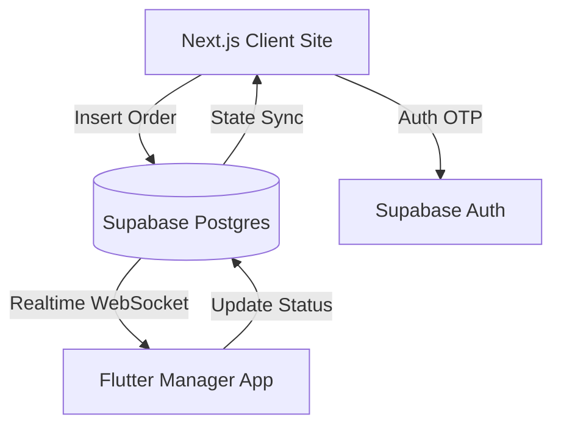

# Angels Livorno - Digital Ecosystem Design Specification

This document details the architectural and technical specifications for the **Angels Livorno Digital Ecosystem**, which includes a customer-facing website and a proprietary order-management app.

## 1. Executive Summary & Brand Identity

The project aims to build a modern, high-performance online ordering ecosystem for the restaurant **Angels Kebab & Fast Food** in Livorno, Italy (Piazza Mazzini 82/83). 

The visual identity is defined in the [Brand Style Guide](file:///c:/Users/Utente/Desktop/Angels%20website/docs/superpowers/specs/brand_style.md), utilizing warm orange (#EA580C) and bright gold (#FACC15) gradients combined with heavy geometric sans-serif headings, mimicking their physical flyer menus.

---

## 2. System Architecture

### Components:
1. **Client Web App (Next.js)**: Optimized for fast initial load, SEO, and visual asset delivery. Customer browses the menu, manages a local cart, and submits orders.
2. **Manager Desktop App (Flutter)**: Running in the restaurant on Windows. Listens to database updates via WebSockets, playing alarms, showing toast notifications, and displaying order details.
3. **Backend (Supabase)**: Provides Serverless PostgreSQL database, phone number verification (OTP), file storage for product images, and instant WebSocket notifications.

---

## 3. Database Schema

The database has been initialized and deployed to the Supabase Cloud instance.

### Tables:
* **`profiles`**: Links users authenticated via phone numbers with their contact info.
* **`menu_items`**: Menu catalog containing items (Kebab, Pizza, Biryani) with categories, prices, and status.
* **`orders`**: Tracks order details, quantities, delivery addresses, payments, and workflow states.

### Realtime Configuration:
Supabase Realtime is enabled on the `orders` and `menu_items` tables to broadcast inserts and updates instantly.

---

## 4. Workflows & Features

### A. Ordering & Checkout
* **Guest Checkout (Ordine Rapido)**: No registration needed. Users enter their name, delivery address, and phone number, and pay on delivery (COD).
* **Supabase OTP Auth**: Users sign in by entering their mobile number and receiving a 6-digit verification code. Subsequent orders pull saved profile data automatically.
* **Stripe Hook**: Payment method is set to Cash on Delivery (`cod`). The UI and schema are pre-built to support Stripe integration (`stripe`) in the future via custom payment sheets.

### B. Manager Notifications (Flutter Windows Desktop)
* **WebSocket subscription**: Subscribes to insert events on `public:orders`.
* **Alarm System**: When a new order arrives, the app plays an alarm sound (`assets/sounds/alert.mp3`) using `audioplayers`.
* **OS Toast Alert**: Windows displays a toast notification using `local_notifier`.
* **Window Activation**: Clicking the toast calls `window_to_front` to bring the manager app immediately to the foreground.

---

## 5. Verification & Test Plan

### Database verification:
- Validate schema by querying tables from the Supabase CLI.
- Run tests on Realtime publications.

### Manual Verification:
- Submit a mock order from the client page (mockup active at `http://localhost:60386`) and observe the database logs in Supabase.
